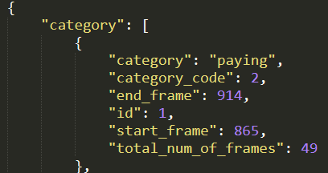
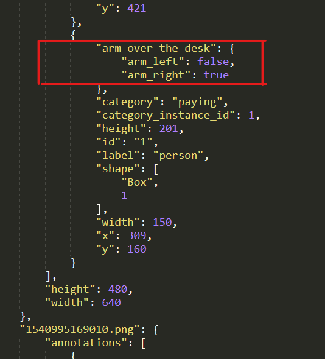
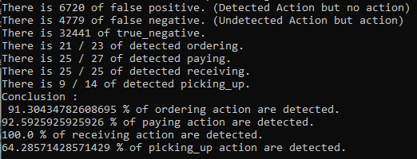

# PlotCorrelationFrom3DDetection

## Required

You'll need to have in the same directory (the one where the program .py is) 2 Json files. One is the output of the 3D Detection (called ArmOverTheDesk : **https://github.com/cladr068/3DActionsDetection**) and the other one come from the application Viva Statistics (called details : **https://github.com/cladr068/VivaStatistics**).
- Details from Viva statistics example :

- ArmOverTheDesk from 3D Detection example:

**Warning** : Make sure that the json files are called repectively `AnnotationWithArmsOverTheDesk.json` and `detail.json`.

## Run the program

Run the python program `correlation_printer.py` with Anaconda Prompt with the follow command line : 

`python correlation_printer [category]`

Where `[category]` can be : 
- `paying`
- `ordering`
- `receiving`
- `picking_up`

You'll see the plot correlation for the action you want. When you quit the plot, you'll get the statistics from the files you entered like that : 

Legend of the plot :

- Red : Arm **right** over the desk
- Blue : Arm **left** over the desk
- Gold : Action you selected. 
